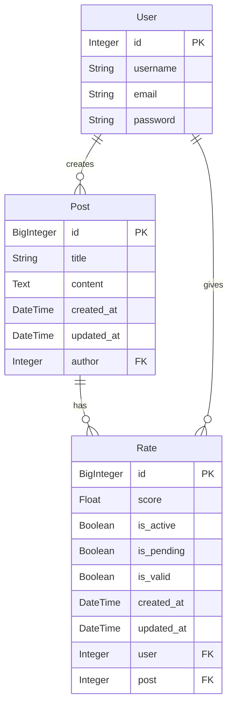

# BitPin Rating System

A Django-based rating system that allows users to rate posts.

## Features

- User authentication and registration
- Post creation and management
- Rating system with validation
- Redis caching for performance
- Batch processing of ratings
- Anti-spam mechanisms

## Setup and Installation

### Prerequisites

- Python 3.8+
- Redis Server
- Virtual Environment

### Step by Step Installation

1. Clone the repository

```bash
git clone <repository-url>
cd bitpinTask
```

2. Create and activate virtual environment

```bash
python -m venv venv
source venv/bin/activate # On Windows use: venv\Scripts\activate
```

3. Install dependencies

```bash
pip install -r requirements.txt
```

4. Configure Redis
   Make sure Redis is installed and running on your system. The project expects Redis to be running on:

```python
bitpinTask/settings.py
startLine: 128
endLine: 136
```

5. Run migrations

```bash
python manage.py migrate
```

6. Create sample data (optional)

```bash
python manage.py create_sample_data
```

7. Run the development server

```bash
python manage.py runserver
```

## Database Schema



## API Endpoints

### Authentication

- `POST /api/auth/register/`: Register new user
- `POST /api/auth/login/`: Login user
- `POST /api/auth/logout/`: Logout user

### Using the API

For easier API testing, you can use my Postman collection. When making requests:

1. Include the CSRF token in your headers:

   ```
   X-CSRFToken: <your-csrf-token>
   ```

2. Set the session ID cookie:
   ```
   sessionid: <your-session-id>
   ```

You can obtain these values after logging in through the browser or initial authentication request.

### Posts

- `GET /api/posts/posts/`: List all posts with ratings
- `GET /api/posts/posts/<id>/`: Get specific post details
- `POST /api/posts/add-score/`: Add rating to a post
- `POST /api/posts/add-post/`: Create a new post

## Cron Jobs

- `python manage.py process_ratings`: Process pending ratings

### run:

1. Make the script executable:

```bash
chmod +x scripts/run_pending_rates.sh
```

2. Open crontab editor:

```bash
crontab -e
```

3. Add the following line to run every

```bash
0 * * * * /path/to/your/scripts/run_pending_rates.sh
```

4. Verify cron job is added:

```bash
crontab -l
```

Note: Replace `/path/to/your` with the actual absolute path to your project directory.

The cron schedule explained:

- `0`: Minute (0-59)
- `*`: Hour (0-23)
- `*`: Day of month (1-31)
- `*`: Month (1-12)
- `*`: Day of week (0-6, 0 is Sunday)

This configuration will run the pending rates processing script at the beginning of every hour.
